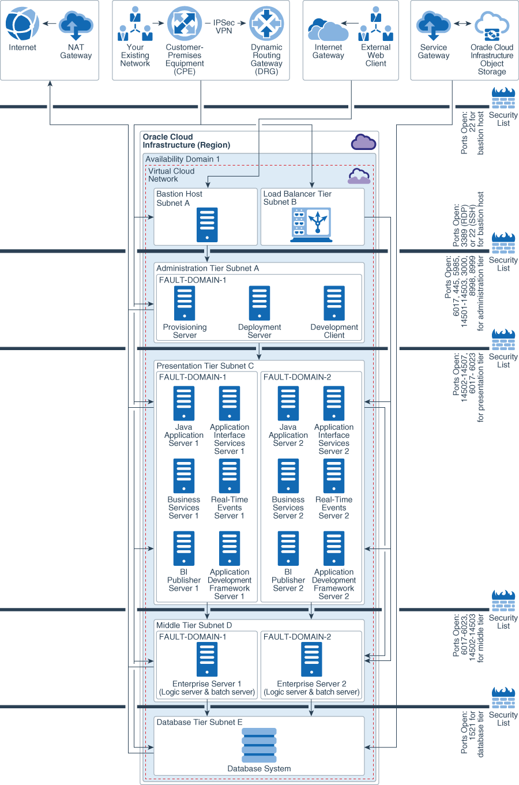
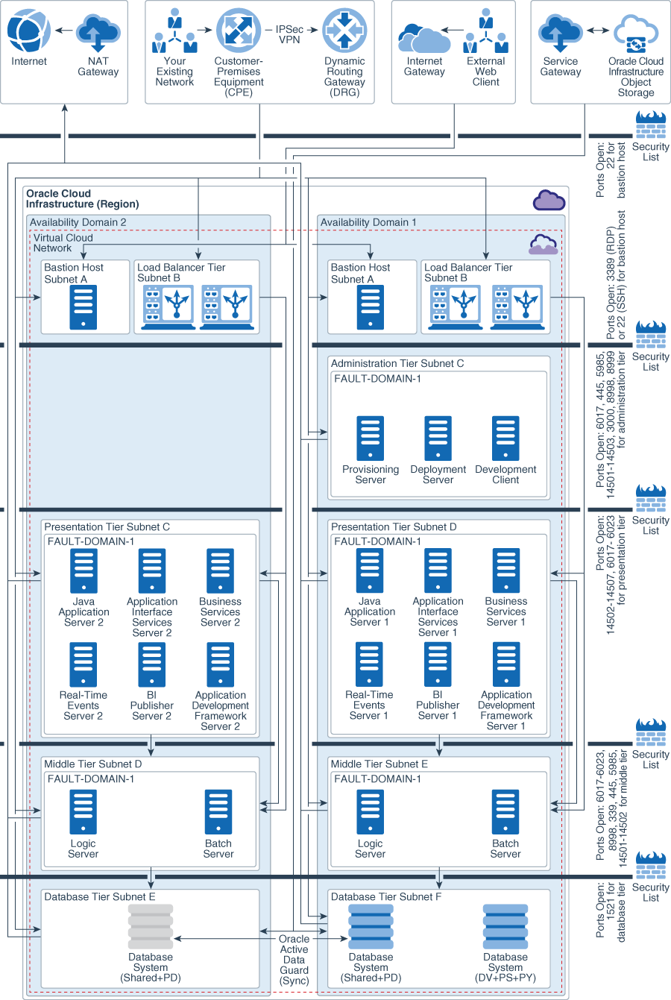

# Terraform modules for JD Edwards on Oracle Cloud Infrastructure

The Terraform modules for JD Edwards allow you to provision infrastructure for JD Edwards on Oracle Cloud Infrastructure using Terraform. JD Edwards can be deployed on Oracle Cloud Infrastructure in single availability domain or multi availability domain architecture.The modules can be used to create infrastructure for JD Edwards in single Availability Domain as well as multiple Availability Domains.

It is recommended to use multiple availability domain architecture for JD Edwards production systems. Terraform modules create the JDEdwards production environments in multiple availability domain architecture and non production environments in single availability domain architecture.

The terraform modules for JD Edwards can create following resources for JD Edwards deployment on Oracle Cloud Infrastructure.
1. Create virtual cloud network (VCN) and other network components like subnets, security lists, service gateway and NAT gateway.
2. Create JD Edwards production environments (PD pathcode) infrastructure in multiple availability domain architecture.
3. Create JD Edwards non production environments (Non PD pathcode) infrastructure in single availability domain architecture.

The terraform code to create JD Edwards production and non-production environments is separate in /JDEdwards directory. So it is possible to provision either or both (production and non-production) environments. The virtual cloud network (VCN) is common for production and non-production environments.

### Architecture for Deploying JD Edwards in a Single Availability domain


### Architecture for Deploying JD Edwards in a multiple Availability domain


For information on Oracle JD Edwards deployment architecture on Oracle Cloud Infrastructure, see

- [Architecture for Deploying Oracle JD Edwards in a Single Availability domain](https://docs.oracle.com/en/solutions/learn-architecture-deploy-jd-edwards/index.html#GUID-02AF6D3A-EC4C-4E73-8F07-9FED516A87EC)
- [Architecture for Deploying Oracle JD Edwards in Multiple Availability domains](https://docs.oracle.com/en/solutions/learn-architecture-deploy-jd-edwards/index.html#GUID-70720E0B-0A03-4784-8DF6-4BF58445C15E)


## Prerequisites

1. [Download and install Terraform](https://www.terraform.io/downloads.html) (v0.11.8 or later)
2. Export OCI credentials using guidance at [Export Credentials](https://www.terraform.io/docs/providers/oci/index.html).
3. The tenancy used for provisoning must have service limits increased to accomodate the build. 

## JD Edwards Terraform modules structure

Terraform modules for Oracle JD Edwards has the following structure:

```
.
├── _docs
│   ├── multiple_availability_domain_jd_edwards_deployment.png
│   └── single_availability_domain_jd_edwards_deployment.png
├── env-vars
├── env-vars.ps1
├── global
│   ├── bastion
│   │   ├── bastion.outputs.tf
│   │   ├── bastion.tf
│   │   └── bastion.variables.tf
│   ├── global.datasources.tf
│   ├── global.main.tf
│   ├── global.outputs.tf
│   ├── global.provider.tf
│   ├── global.routetables.tf
│   ├── global.variables.tf
│   └── network
│       ├── subnets
│       │   ├── subnets.output.tf
│       │   ├── subnets.tf
│       │   └── subnets.variables.tf
│       └── vcn
│           ├── vcn.data.tf
│           ├── vcn.outputs.tf
│           ├── vcn.seclist.tf
│           ├── vcn.tf
│           └── vcn.variables.tf
├── inputJson
│   ├── sample.network.json
│   ├── sample.nonpd.json
│   ├── sample.nonpdsubnet.json
│   ├── sample.pd.json
│   └── sample.pdsubnet.json
├── LICENSE.md
├── modules
│   ├── app
│   │   ├── app.bv.tf
│   │   ├── app.init.tf
│   │   ├── app.outputs.tf
│   │   ├── app.tf
│   │   └── app.variables.tf
│   ├── db
│   │   ├── db.dbsystem.tf
│   │   ├── db.outputs.tf
│   │   └── db.variables.tf
│   ├── dns
│   │   ├── dns.datasources.tf
│   │   ├── dns.main.tf
│   │   ├── dns.outputs.tf
│   │   └── dns.variables.tf
│   ├── lbaas
│   │   ├── lbaas.outputs.tf
│   │   ├── lbaas.tf
│   │   └── lbaas.variables.tf
│   ├── userdata
│   │   ├── db
│   │   ├── dep
│   │   ├── ent
│   │   ├── sm
│   │   └── web
│   └── win
│       ├── win.outputs.tf
│       ├── win.tf
│       └── win.variables.tf
├── nonpd
│   ├── nonpd.datasources.tf
│   ├── nonpd.main.tf
│   ├── nonpd.outputs.tf
│   ├── nonpd.provider.tf
│   └── nonpd.variables.tf
├── pd
│   ├── pd.datasources.tf
│   ├── pd.main.tf
│   ├── pd.outputs.tf
│   ├── pd.provider.tf
│   ├── pd.variables.tf
│   └── web-lb.tf
└── README.md

21 directories, 57 files
```

The are total five directories - global,  modules, inputJson, nonpd and pd.

The **global** directory contains terraform code to create network, subnets, security lists, route tables, internet gateway, service gateway, NAT gateway and bastion host. The teraform code for network lays out the network in two availability domains defined by AD parameter in inputJson/network.json inputs file. The output of terraform apply in this directory lists subnet OCIDs and public IPs of bastion hosts. These subnet OCIDs and bastion host ips are used as inputs to terraform code in **pd** and **nonpd** directories.

The **modules** directory contain modules to create Oracle Cloud Infrastructure resources.

The terraform code in **pd** directory call modules to create JD Edwards production environment in multi availability domain architecture.

The terraform code in **nonpd** directory call modules to create JD Edwards non-production environment in single availability domain architecture.

The terraform apply in global, pd and nonpd directories need certain inputs and these inputs come from JSON files stored in **inputJson** directory.

The high level description of directories and files within five main directories is given below.

- [**root**]:
  - [env-vars]: This is an environment file to set terraform environment variables on UNIX systems.
  - [env-vars.ps1]: This is an environment file to set terraform environment variables on Windows systems.

- [**global**]: This directory contain modules to create network and bastion hosts.
  - [bastion]: The bastion module creates bastion host. The terraform code creates on bastion host per availability domain. The compute shape for bastion host is fixed to VM.Standard2.1 in terraform code.
  - [network]: The network module creates network for JD Edwards deployment.
    - [vcn]: This sub module contains code to create virtual cloud network (VCN), internet gateway, service gateway and NAT gateway.
    - [subnets]: This sub module contains code to create subnets.
    - [global.main.tf]: The global.main.tf and other .tf files under global directory call network and bastion modules to create network and bastion host.

- [**nonpd**]: The nonpd directory contains terraform code to create non production (non PD pathcode) environments. The nonpd.main.tf file call modules (under modules directory) to create Oracle Cloud Infrastructure resources.

- [**pd**]: The pd directory contains terraform code to create production (PD pathcode) environments. The pd.main.tf file call modules (under modules directory) to create  Oracle Cloud Infrastructure resources.

- [**inputJson**]: This directory contains input files (in JSON format).
  - [network.json]: This is a json input file used to create network and bastion host. This is used by network and bastion modules under global directory.
  - [pdsubnet.json]: This is a json input file to provide subnet OCIDs and bastion host IP information to build Oracle Cloud Infrastructure resources for JDEdwards production environment. This is used when terraform apply is executed in pd directory.
  - [nonpdsubnet.json]: This is a json input file to provide subnet OCIDs and bastion host IP information to build Oracle Cloud Infrastructure resources for JDEdwards non production environment. This is used when terraform apply is executed in non pd directory.
  - [pd.json]: This is a json input file to provide environment (compute, database, load balancer etc) details to build Oracle Cloud Infrastructure resources for JDEdwards production environment. This is used when terraform apply is executed in pd directory.
  - [nonpd.json]: This is a json input file to provide environment (compute, database, load balancer etc) details to build Oracle Cloud Infrastructure resources for JDEdwards non production environment. This is used when terraform apply is executed in pd directory.

- [**modules**]: The modules directory contain modules to create compute, database system and load balancer.
  - [app]: This module creates Oracle Linux compute instances on Oracle Cloud Infrastructure.
  - [win]: This module creates windows compute instances.
  - [db]: This module creates Oracle Cloud Infrastructure database system.
  - [dns]: This module creates Oracle Cloud Infrastructure DNS (Domain Name Service) zone and records.
  - [lbaas]: This module creates Oracle Cloud Infrastructure Load Balancing service.
  

## How to use these modules

Go to JDEdwards directory:

```
$ cd JDEdwards
```
Update **env-vars** (or **env-vars.ps1** for Windows) with the required information. The file contains definitions of environment variables for your Oracle Cloud Infrastructure tenancy.

### 1. Create network and bastion host

```
$ cd global
$ source ../env-vars
$ terraform init
$ terraform apply -var-file ../inputJson/network.json
```

The network module creates virtual cloud network and subnets in two availability domains. The output of terraform apply provides subnet OCIDs and bastion host public IPs. These subnet OCIDs and first bastion host IP is required to be noted and updated into pdsubnet.json and nonpdsubnet.json file manually in next step.

### 2. Create JD Edwards Production Environment (PD pathcode)

1. For JDEdwards production environment multiple availability domain deployment, update subnet OCIDs of both availability domain 1 and 2 subnets in pdsubnets.json file. The IP address of first bastion host is also required to be updated. A running sample (sample.pdsubnet.json) file is available in JDEdwards/inputJson directory and can be used. 

2. Update **pd.json**  in inputJson directory to define other inputs. The db_admin_password is also required to be updated. A running sample (sample.pd.json) file is available in JDEdwards/inputJson directory and can be used. 

3. Initialize Terraform. This will also download the latest terraform oci provider.

```
$ cd JDEdwards/pd
$ source ../env-vars
$ terraform init
$ terraform apply -var-file ../inputJson/pdsubnet.json -var-file ../inputJson/pd.json
```
When you’re prompted to confirm the action, enter **yes**.

When all components have been created, Terraform displays a completion message. For example: Apply complete! Resources: 200 added, 0 changed, 0 destroyed.

### 3. Create JD Edwards Non production Environment (non PD pathcode)

1. For JDEdwards non production environment single availability domain deployment, update subnet OCIDs of only one (either 1 or 2) availability domain in nonpdsubnets.json file. The IP address of first bastion host is also required to be updated. A running sample (sample.nonpdsubnet.json) file is available in JDEdwards/inputJson directory and can be used. 

2. Update **nonpd.json** in inputJson directory to define other inputs. The db_admin_password is also required to be updated. A running sample (sample.nonpdsubnet.json) file is available in JDEdwards/inputJson directory and can be used. 

3. Initialize Terraform. This will also download the latest terraform oci provider.

```
$ cd JDEdwards/nonpd
$ source ../env-vars
$ terraform init
$ terraform apply -var-file ../inputJson/nonpdsubnet.json -var-file ../inputJson/nonpd.json
```
When you’re prompted to confirm the action, enter **yes**.

When all components have been created, Terraform displays a completion message. For example: Apply complete! Resources: 9 added, 0 changed, 0 destroyed.


If you want to delete the infrastructure, run:

```
$ terraform destroy
```

When you’re prompted to confirm the action, enter **yes**.

The destory command is required to be run from respective directores (pd, nonpd and global)

To delete network infrastructure, delete resources for production (pd) and non production (pd) JDEdwards environments first.

## Information about Oracle Cloud Infrastructure resources built by Terraform modules for JD Edwards

* Separate pairs of SSH keys can be used for bastion host and rest of the compute infrastructure resources. It is also possible to use the same key. In that case, same key is required as input to instance and bastion instance variables in env-vars or env-vars.ps1 file.

  For example,
  ```
  ### Public/private keys used on the instance
  export TF_VAR_ssh_public_key=/home/oracle/tf/<mykey.pub>
  export TF_VAR_ssh_private_key=/home/oracle/tf/<mykey.pem>

  ### Public/private keys used on the bastion instance
  export TF_VAR_bastion_ssh_public_key=/home/oracle/tf/<mykey.pub>
  export TF_VAR_bastion_ssh_private_key=/home/oracle/tf/<mykey.pem>

  ```
  For terraform installations on Unix systems, the private half of SSH key pairs should be in OpenSSH format. The instances in private subnet can be reached via SSH on port 22 by allowing agent forwarding in Putty and using Putty authentication tool like Pageant. Note that this does not require copying private SSH key for instances to bastion host.

* The terraform modules ensure that same tier instances are deployed across different Fault Domains within an availability domain. Fault Domains protect against unexpected hardware failures and against planned outages due to compute hardware maintenance. For Real application clusters database, each node of cluster is deployed in a separate Fault domains by default.

* The Terraform modules always use latest Oracle Linux image for the chosen operating system for provisioning compute instances. 
There are chances that minor version of operating system gets upgraded and a new image gets published in Oracle Cloud Infrastructure console. In that case, always check the available version of image from oracle Cloud Infrastructure compute console to input this value. For example, if Oracle Linux version is chnaged from version 7.5 to 7.6, change this value from 7.5 to 7.6.  

* The standby database has to be built manually after your Oracle JD Edwards environment has been built. For creating a standby database, see [Using Oracle Data Guard with the Database CLI](https://docs.cloud.oracle.com/iaas/Content/Database/Tasks/usingDG.htm?tocpath=Services%7CDatabase%7CBare%20Metal%20and%20Virtual%20Machine%20DB%20Systems%7C_____11)

* The terraform version has been locked to 0.11.8 and Oracle Cloud Infrastructure provider version has been locked to 3.5.1 in provider.tf file. To use a version higher than these versions, change the values in the provider.tf file. The terraform modules may require changes for a successful run with a new terraform and Oracle Cloud Infrastructure provider version. 


# License
Copyright © 2018, Oracle and/or its affiliates. All rights reserved. 
The Universal Permissive License (UPL), Version 1.0 
Please see LICENSE.md for full details
