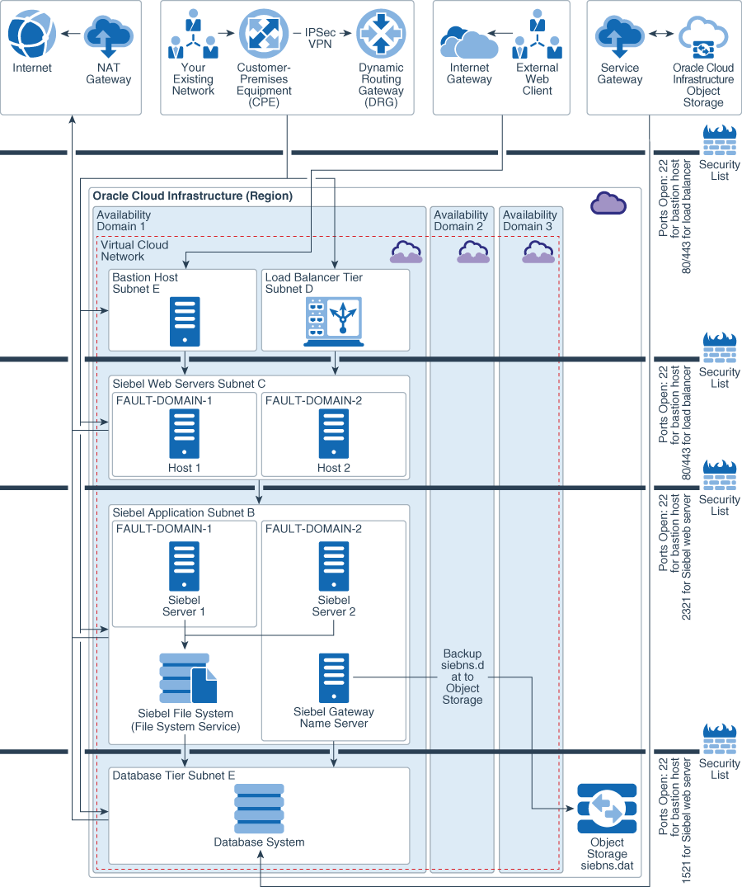
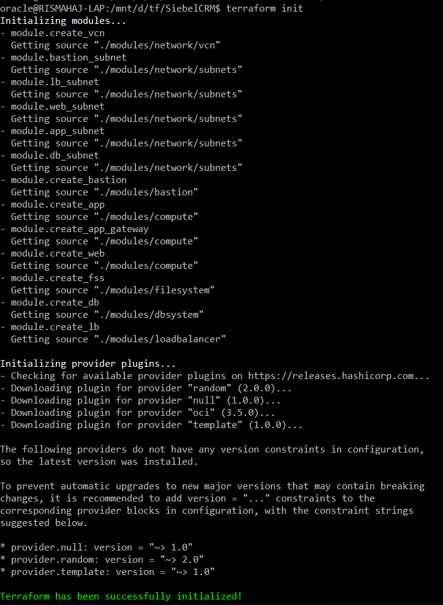

# Terraform modules for deploying Siebel CRM on Oracle Cloud Infrastructure

These Terraform modules for Siebel CRM allow you to provision infrastructure for Siebel CRM on Oracle Cloud Infrastructure using Terraform.
The Terraform modules can be used to create infrastructure for Siebel CRM in single Availability Domain.

### Architecture for Deploying Siebel CRM in a Single Availability domain


For information on Siebel CRM deployment on Oracle Cloud Infrastructure see

- [Architecture for Deploying Siebel CRM in a Single Avalability domain](https://docs.oracle.com/en/solutions/learn-architecture-deploy-siebel/index.html#GUID-CE993A4C-CFEF-4F55-8489-0905D796CBAA)


## Prerequisites

1. [Download and install Terraform](https://www.terraform.io/downloads.html) (v0.11.8 or later)
2. Export OCI credentials using guidance at [Export Credentials](https://www.terraform.io/docs/providers/oci/index.html).

## Siebel CRM Terraform modules structure

Terraform modules for Siebel CRM has the following folder structure:

```
.
├── datasources.tf
├── _docs
│   ├── single_availability_domain_siebel_crm_deployment.png
│   ├── terraform-apply-singlead.png
│   └── terraform-init.png
├── env-vars
├── fss-remote-exec.tf
├── LICENSE.md
├── main.tf
├── modules
│   ├── bastion
│   │   ├── bastion.outputs.tf
│   │   ├── bastion.tf
│   │   └── bastion.vars.tf
│   ├── compute
│   │   ├── compute.blockvolume.tf
│   │   ├── compute.outputs.tf
│   │   ├── compute.tf
│   │   └── compute.variables.tf
│   ├── dbsystem
│   │   ├── db.datasources.tf
│   │   ├── db.dbsystem.tf
│   │   └── db.variables.tf
│   ├── filesystem
│   │   ├── fss.data.tf
│   │   ├── fss.outputs.tf
│   │   ├── fss.tf
│   │   └── fss.vars.tf
│   ├── loadbalancer
│   │   ├── lb.tf
│   │   └── lb.vars.tf
│   └── network
│       ├── subnets
│       │   ├── subnets.output.tf
│       │   ├── subnets.tf
│       │   └── subnets.vars.tf
│       └── vcn
│           ├── vcn.data.tf
│           ├── vcn.outputs.tf
│           ├── vcn.tf
│           └── vcn.vars.tf
├── outputs.tf
├── provider.tf
├── README.md
├── routetables.tf
├── seclist.tf
├── terraform.tfvars
├── userdata
│   ├── bootstrap.tpl
│   └── mountfss.sh
└── variables.tf

11 directories, 40 files
```

- [**root**]:
  - [env-vars]: This is an environment file to set terraform environment variables on UNIX systems.
  - [env-vars.ps1]: This is an environment file to set terraform environment variables on Windows systems.
  - [datasources.tf]: This is terraform data source file to fetch data for Oracle Cloud Infrastructure resources.
  - [main.tf]: At root level, main.tf calls different modules to create Oracle Cloud Infrastructure resources. 
  - [outputs.tf]: This is the terraform outputs file.
  - [provider.tf]: This is the terraform provider file that defines the provider (Oracle Cloud Infrastructure) and authentication information.
  - [variables.tf]: This is the terraform variables file to declare variables.
  - [routetables.tf]: This file creates route tables.
  - [seclists.tf]: This file creates security lists.
  - [terraform.tfvars]: This is an input file to pass values to declared variables.

- [**modules**]: The modules directory contain all the modules required for creating Oracle Cloud Infrastructure resources.
  - [bastion]: This module is used to create bastion hosts.
  - [compute]: This module is used  to create unix and windows compute instances.
  - [dbsystem]: This module is used to create Oracle Cloud Infrastructure database system.
  - [filesystem]: This module is used to create Oracle Cloud Infrastructure File Storage service filesystem.
  - [loadbalancer]: This module is used to create Oracle Cloud Infrastructure load Balancing service.
  - [network]: This module is used to create network resources like VCN (Virtual Cloud Network),subnets, internet gateway, service gateway, dynamic routing gateway and NAT (network Address Translation) gateway.
    - [vcn]: This sub module creates the VCN, internet gateway, service gateway, dynamic routing gateway and NAT gateway.
    - [subnets]: This sub module create subnets within a VCN.

  - [**userdata**]: This directory contains bootstrap and shell scripts.
    - [bootstrap.tpl]: This file contains cloud-init configuration to bootstrap compute instances.
    - [mountfss.sh]: This is a bash script to mount siebel filesystem on siebel servers.
  

## Inputs required in the terraform.tfvars file

The following inputs are required for this module:

| Argument                   | Description                                                                                                                                                                                                                                                                                                                                                       |
| -------------------------- | ----------------------------------------------------------------------------------------------------------------------------------------------------------------------------------------------------------------------------------------------------------------------------------------------------------------------------------------------------------------- |
| AD                         | Availability Domain for Oracle E-Business Suite Deployment. This variable drives the Oracle E-Business Suite architecture to be deployed. Setting AD = ["1"] deploys infrastructure in single availability domain (Availabilty domain 1 of the tenancy in this case) and AD = ["1","2"] deploys infrastructure in multiple ADs (Avilability domains 1 and 2 of the tenancy in this case). |
| vcn_cidr                   | CIDR block of the VCN (Virtual Cloud Network) to be created.                                                                                                                                                                                                      |
| vcn_dns_label              | DNS Label of the VCN (Virtual Cloud Network) to be created.                                                                                                                                                                                                                                                                                                                               |
| linux_os_version           | Operating system version of Oracle Linux for compute instances. The terraform module for compute instances always pick up the latest image available for the chosen Oracle Linux version in the region.                                                                                                                       |
| timezone                   | Timezone of compute instances.                                                                                                                                                                                                                                                                                                                                  |
| bastion_user               | User name to log in to bastion host.                                                                                                                                                                                                                                                                                                                              |
| compute_boot_volume_size_in_gb | Size of boot volume in gb for compute instance.                                                                                                                                                                                                                                                                                                               |
| compute_block_volume_size_in_gb | Size of block volume in gb for compute instance.                                                                                                                                                                                                                                                                                                               |
| compute_instance_user          | User name to log in to compute instance.                                                                                                                                                                                                                                                                                                                      |
| siebel_env_prefix                 | Environment prefix to define names of Siebel CRM resources.                                                                                                                                                                                                                                                                                                                   |
| siebel_server_instance_count     | Number of Siebel CRM siebel server instances to be created.  |
| siebel_server_instance_shape         | Shape of siebel server instance. For more information on available shapes, see [VM Shapes](https://docs.cloud.oracle.com/iaas/Content/Compute/References/computeshapes.htm?TocPath=Services#vmshapes)                                                                                                                                                               |
| siebel_server_instance_listen_port   | Port on which Siebel server instance will listen and receive requests from Load Balancer.                                                                                                                                                                                                                                                                                             |
| siebel_filesystem_path | Mount path for Siebel filesystem. For example /siebelfs                                                                                                                                                                                                                                                                            |
| siebel_filesystem_size_limit_in_gb | Upper limit for Siebel filesystem. This value is just to set an upper size limit visible to Siebel CRM. It does not restrict storage size of Filesystem Storage Service.                                                                                                                                                                                                                                                                                     |
| siebel_web_instance_count     | Number of Siebel web server instances to be created.                          |
| siebel_web_instance_shape         | Shape of siebel web servers instances. For more information on available shapes, see [VM Shapes](https://docs.cloud.oracle.com/iaas/Content/Compute/References/computeshapes.htm?TocPath=Services#vmshapes)                                                                                                                                                               |
| siebel_web_instance_listen_port   | Port on which Siebel web server instance will listen and receive requests from Load Balancer.                                                                                                                                                                                                                                                                                             |
| siebel_gateway_instance_count     | Number of Siebel Gateway instances to be created.       |
| siebel_gateway_instance_shape         | Shape of siebel gateway server instance. For more information on available shapes, see [VM Shapes](https://docs.cloud.oracle.com/iaas/Content/Compute/References/computeshapes.htm?TocPath=Services#vmshapes)                                                                                                                                                               |
| db_edition                 | Edition of database.     
| db_license_model           | Licensing model for database.                                                                                                                                                                                                                                                                                                                                     |
| db_version                 | Version of database.                                                                                                                                                                                                                                                                                                                                              |
| db_node_count              | Number of database nodes. For single instance database, this parameter should be 1 and for Real Application Cluster Database, this parameter should be set to 2.                                                                                                                                                                                                  |
| db_instance_shape          | Shape of Database nodes. For RAC, the minimum required shape is VMStandard1.2.                                                                                                                                                                                                                                                                                    |  
| db_name                    | Name of Database Container.                                                                                                                                                                                                                                                                                                                                                    |
| db_size_in_gb              | Size of database in gb. For more information, see [Oracle Cloud Infrastructure Images](https://docs.cloud.oracle.com/iaas/images/)                                                                                                                                                                                                                                      |
| db_admin_password          | Database administration password (sys password).                                                                                                                                                                                                                                                                                                                  |  
| db_characterset            | Characterset of database.                                                                                                                                                                                                                                                                                                                                         |
| db_nls_characterset        | National Characterset of database.                                                                                                                                                                                                                                                                                                                                     |                                                                                                                                                                                                                                                                                                                                     |
| db_pdb_name                | Starter Pluggable database name.                                                                                                                                                                                                                                                                                                                                          |
| load_balancer_hostname     | Hostname of the load balancer.                                                                                                                                                                                                                                                                                                                                    |
| load_balancer_shape        | Shape of the load balancer.                                                                                                                                                                                                                                                                                                                                       |
| load_balancer_listen_port  | Listen port of the load balancer.                                                                                                                                         |

##### Sample terraform.tfvars file to create a Siebel CRM single availability domain architecture

```hcl
# AD (Availability Domain to use for creating Siebel infrastructure) 
AD = ["1"]

# CIDR block of VCN to be created
vcn_cidr = "172.16.0.0/16"

# DNS label of VCN to be created
vcn_dns_label = "sblvcn"

# Operating system version to be used for application instances
linux_os_version = "6.10"

# Timezone of compute instance
timezone = "America/New_York"

# Login user for bastion host
bastion_user = "opc"

# Size of boot volume (in gb) of application instances
compute_boot_volume_size_in_gb = "100"

# Size of block volume (in gb) of application instances
compute_block_volume_size_in_gb = "100"

# Login user for compute instance
compute_instance_user = "opc"

#Environment prefix to define name of resources
siebel_env_prefix = "sbldev"

# Number of application instances to be created
siebel_server_instance_count = "2"

# Shape of app instance
siebel_server_instance_shape = "VM.Standard2.2"

# Listen port of the application instance
siebel_server_instance_listen_port = ["2320","2321"]

# Mount path for application filesystem
siebel_filesystem_path = "/siebelfs"

# Set filesystem limit
siebel_filesystem_size_limit_in_gb = "500"

# Number of application instances to be created
siebel_web_instance_count = "2"

# Shape of app instance
siebel_web_instance_shape = "VM.Standard2.1"

# Listen port of the application instance
siebel_web_instance_listen_port = "80"

# Number of application instances to be created
siebel_gateway_instance_count = "1"

# Shape of app instance
siebel_gateway_instance_shape = "VM.Standard2.2"

# Database Edition
db_edition = "ENTERPRISE_EDITION_EXTREME_PERFORMANCE"

# Licensing model for database
db_license_model = "LICENSE_INCLUDED"

# Database version
db_version = "12.1.0.2"

# Number of database nodes
db_node_count = "2"

#Shape of Database nodes
db_instance_shape = "VM.Standard2.4"

#Database name
db_name = "SBLCDB"

#Size of Database
db_size_in_gb = "256"

# Database administration (sys) password
db_admin_password = "<password>"

# Characterset of database
db_characterset = "AL32UTF8"

# National Characterset of database
db_nls_characterset = "AL16UTF16"

# Pluggable database name
db_pdb_name = "SBLPDB"

# Hostname of Load Balancer
load_balancer_hostname = "sbl.example.com"

# Shape of Load Balancer
load_balancer_shape = "100Mbps"

#Listen port of load balancer
load_balancer_listen_port = "80"
```

### Information about Oracle Cloud Infrastructure resources built by Terraform modules for Siebel CRM

* The Terraform modules create Files Storage service file system for Siebel Filesystem. The filesystem is mounted on Siebel Servers. 

* The Terraform modules creates private load balancer with backend containing siebel web servers. 

* Separate pairs of SSH keys can be used for bastion host and rest of the compute infrastructure resources. It is also possible to use the same key. In that case, same key is required as input to instance and bastion instance variables in env-vars or env-vars.ps1 file.

  For example,
  ```
  ### Public/private keys used on the instance
  export TF_VAR_ssh_public_key=/home/oracle/tf/<mykey.pub>
  export TF_VAR_ssh_private_key=/home/oracle/tf/<mykey.pem>
  ### Public/private keys used on the bastion instance
  export TF_VAR_bastion_ssh_public_key=/home/oracle/tf/<mykey.pub>
  export TF_VAR_bastion_ssh_private_key=/home/oracle/tf/<mykey.pem>
  ```
  For terraform installations on Unix systems, the private half of SSH key pairs should be in OpenSSH format. The instances in private subnet can be reached via SSH on port 22 by allowing agent forwarding in Putty and using Putty authentication tool like Pageant. Note that this does not require copying private SSH key for instances to bastion host.

* The terraform modules ensure that same tier instances are deployed across different Fault Domains with an availability domain. Fault Domains protect against unexpected hardware failures and against planned outages due to compute hardware maintenance. For Real application clusters database, each node of cluster is deployed in a separate Fault domain by default.

* The terraform modules expose timezone variable which can be used to define timezone for provisioned compute instances. The code uses cloud-init to do that. For database system, timezone has to be set manually using OS specific procedure. Follow OS specific documentation to do that.

* The terraform version has been locked to 0.11.8 and Oracle Cloud Infrastructure provider version has been locked to 3.5.1 in provider.tf file. To use a version higher than these versions, change the values in the provider.tf file. The terraform modules may require changes for a successful run with a new terraform and Oracle Cloud Infrastructure provider version. 


## Cloud-init template for siebel servers

Following are sample inline code to install RPMs, configure NTP and mount file systems on application servers:

```yaml
#cloud-config
timezone: "${timezone}"

packages:
  - nfs-utils
  - oracle-rdbms-server-12cR1-preinstall.x86_64
```

## How to use this module

1) Go to SiebelCRM directory

  ```
  cd SiebelCRM
  ```

2) Update **env-vars** (or **env-vars.ps1** for Windows) with the required information. The file contains definitions of environment variables for your Oracle Cloud Infrastructure tenancy.

3) Update **terraform.tfvars** with the inputs for the architecture that you want to build. A running sample of this file for multiple availability domain architecture is available in previous section. The contents of sample file can be copied to create a running inputs file. Update db_admin_password with actual password in terraform.tfvars file.

4) Initialize Terraform. This will also download the latest terraform oci provider.

  ```
  $ terraform init
  ```
  

5) Set environment variables by running source **env-vars** on your UNIX system or by running **env-vars.ps1** on your Windows system.

  ```
  $ source env-vars
  ```

6) Run terraform apply to create the infrastructure:

  ```
  $ terraform apply
  ```

When you’re prompted to confirm the action, enter **yes**.

When all components have been created, Terraform displays a completion message. For example: Apply complete! Resources: 48 added, 0 changed, 0 destroyed.

7) If you want to delete the infrastructure, run:

  ```
  $ terraform destroy
  ```

When you’re prompted to confirm the action, enter **yes**.

# License
Copyright © 2018, Oracle and/or its affiliates. All rights reserved. 
The Universal Permissive License (UPL), Version 1.0 
Please see LICENSE.md for full details
